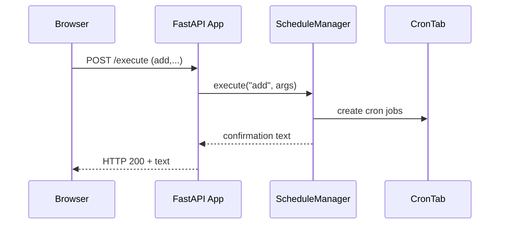

# Client Web Application

This folder contains a small FastAPI based web application used to manage the
schedules and states of several sensors. The application exposes a web UI for
routine operations and a command line interface for scripting or debugging.

## Project Layout

```text
Client_Webapp/
├── main.py                 # FastAPI application entry point
├── cli.py                  # Command line interface for schedule management
├── services/
│   └── schedule_manager.py # Core scheduling logic
├── scripts/                # Miscellaneous helper scripts
│   ├── LogSerialData.py
│   ├── Runshellcommand.py
│   ├── SocketTest.py
│   └── client.py
├── static/                 # Front‑end assets served by FastAPI
│   ├── index.html
│   └── schedule.js
├── schedule_files/         # Uploaded schedule files
├── sensor_schedule.json    # Persistent schedule/override storage
└── README.md
```

## Running the Web Application

1. Install dependencies:
   ```bash
   pip install fastapi uvicorn python-crontab
   ```
2. Start the server:
   ```bash
   python main.py
   ```
   The application listens on `http://localhost:8000`.
3. Open a browser to `http://localhost:8000` to access the management UI.

### What happens when you interact with the UI?

- **Add/Remove Schedule** – the browser issues a request to `/execute` with the
  appropriate command. The FastAPI app forwards the request to
  `ScheduleManager`, which persists the schedule and updates the system
  `crontab`.
- **View Schedules/States** – the browser requests `/view_schedules` or
  `/view_states`; the server responds with the current information as plain
  text.
- **Upload Schedule** – the selected JSON file is stored under
  `schedule_files/` for future use.

The following diagram shows the interaction when a schedule is added via the web
UI:



## Command Line Interface

The same scheduling capabilities are available from the command line using
`cli.py`.

```bash
# Add a schedule
python cli.py add AML 08:00 12:00 on --repeat --days Mon,Wed,Fri

# View schedules
python cli.py view

# Override a sensor
python cli.py override AML off

# Remove an override
python cli.py remove_override AML
```

## Development Notes

- `services/schedule_manager.py` contains all scheduling logic and can be
  imported by other modules if needed.
- Additional helper scripts are stored in `scripts/`. These are not used by the
  web application directly but can be useful for diagnostics.

