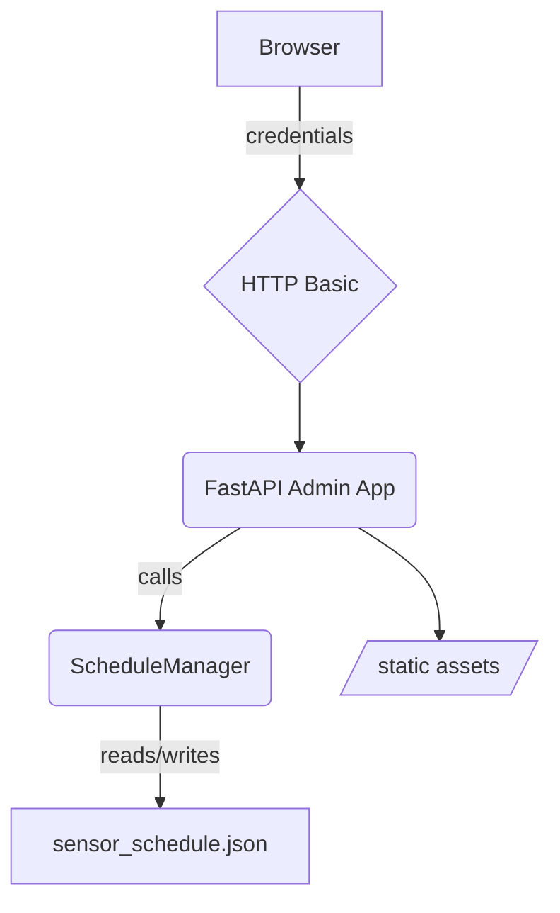
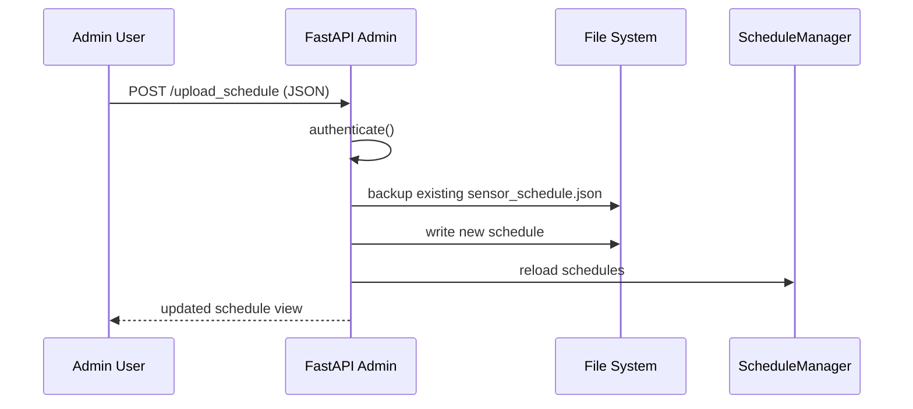

# Admin Web Application

An authenticated dashboard for privileged users to manage sensor scheduling and state overrides.

## Architecture

The admin application mirrors the public client app but adds HTTP Basic authentication on every route. It relies on modules in `webapps/shared` for its user interface and scheduling logic:

- `static/index.html` and `static/schedule.js` deliver the HTML interface and browser-side JavaScript.
- `services/schedule_manager.py` stores schedules in `schedule_files/sensor_schedule.json` and issues `cron` jobs.
- `schedule_files/on_hold` acts as a backup location when a new schedule file is uploaded.



## Workflow

All endpoints require valid credentials supplied via the browser's Basic Auth dialog. Once authenticated the user can:

- `POST /execute` – forward scheduling commands (`add`, `remove`, `override`, `remove_override`).
- `GET /view_schedules` – view every scheduled action.
- `GET /view_states` – check the current state of each sensor.
- `POST /upload_schedule` – replace `sensor_schedule.json` and move the previous file to `schedule_files/on_hold`.

Uploading a new schedule follows this sequence:



## Project Layout

```text
admin/
├── __init__.py
├── main.py   # FastAPI app with Basic auth
└── README.md
```

## Running the Web Application

Create a `.env` file with the desired credentials and launch the server:

```bash
pip install fastapi uvicorn python-crontab python-dotenv
echo -e "USERNAME=admin\nPASSWORD=secret" > .env
uvicorn webapps.admin.main:app --reload
```

Navigate to <http://localhost:8000> and provide the configured username and password when prompted. The application uses shared assets and scheduling logic stored in `webapps/shared`.
