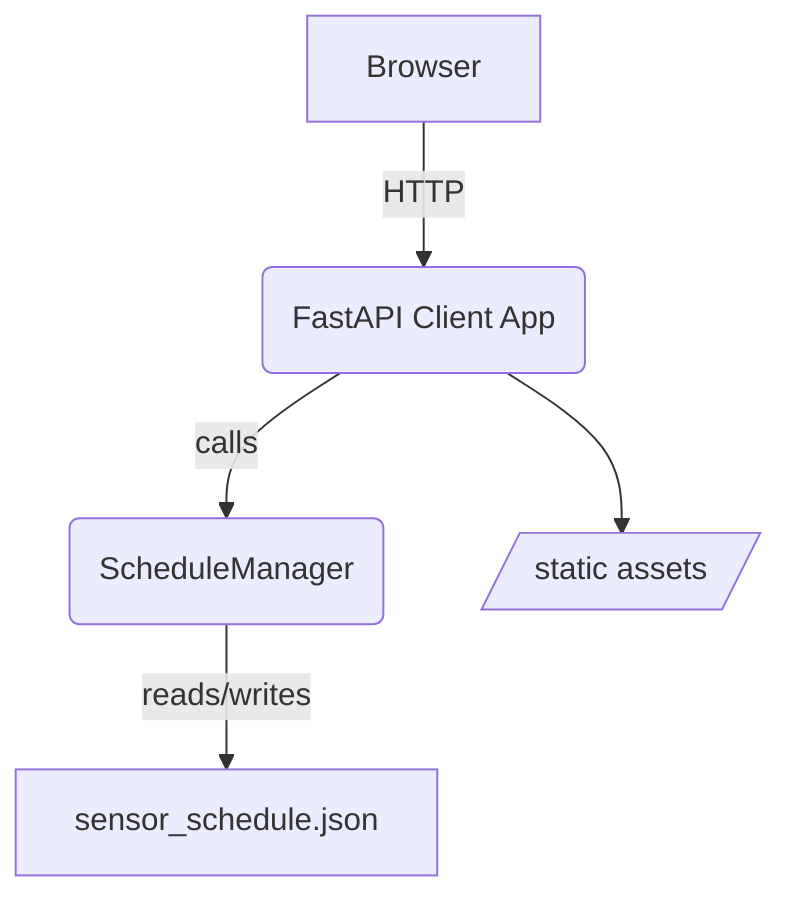
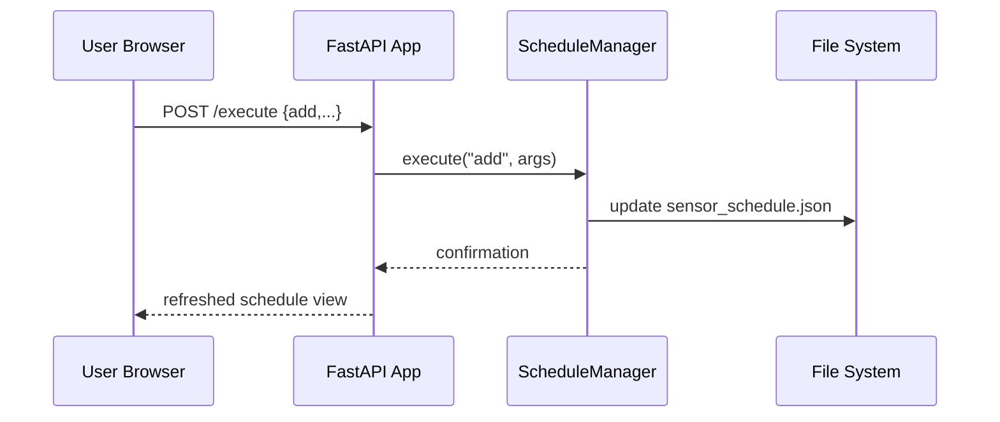

# Client Web Application

A user-facing FastAPI service that lets operators view and modify sensor schedules through a simple browser interface.

## Architecture

The client app is a thin wrapper around shared logic found in `webapps/shared`:

- `static/index.html` and `static/schedule.js` provide the HTML interface and browser-side JavaScript.
- `services/schedule_manager.py` persists schedules in `schedule_files/sensor_schedule.json` and creates `cron` jobs to actuate hardware at the right time.

The relationships between the components are illustrated below:



## Workflow

When a user visits the root URL the app serves `index.html`. The page loads `schedule.js`, which communicates with the backend through a handful of endpoints:

- `POST /execute` – dispatches commands such as `add`, `remove`, `override`, or `remove_override` to the `ScheduleManager`.
- `GET /view_schedules` – returns a text representation of all scheduled actions.
- `GET /view_states` – reports each sensor's current state.
- `POST /upload_schedule` – accepts a JSON file and replaces `sensor_schedule.json`.

A typical interaction for adding a schedule looks like this:



## Project Layout

```text
client/
├── __init__.py
├── main.py       # FastAPI application entry point
└── README.md
```

## Running the Web Application

Install the dependencies and start the development server:

```bash
pip install fastapi uvicorn python-crontab
uvicorn webapps.client.main:app --reload
```

Open <http://localhost:8000> and interact with the forms to manage schedules. The service automatically reads and writes shared files in `webapps/shared`.
